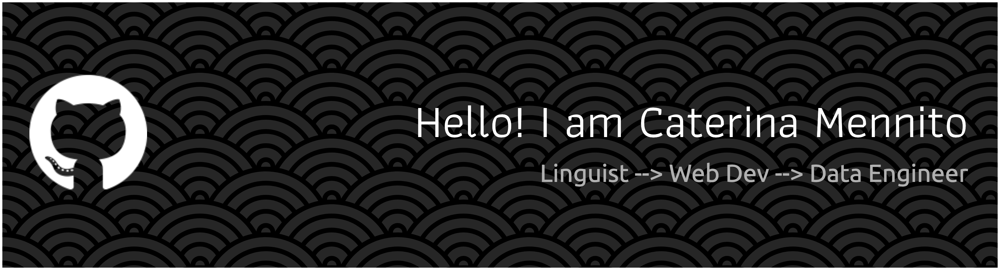

##  Menu
- [About Me](#about-me)
- [Curriculum Vitae](#curriculum-vitae)
- [Featured Projects](#featured-projects)
- [Connect with Me](#connect-with-me)

---

## About Me

 

Hi there 👋 I'm Caterina!  

Originally from Italy, I'm currently based in Belgium.
I’ve always been curious by nature and love diving into new challenges.  
My journey started in literature 📚, but along the way I discovered a real passion for tech, problem-solving, and building things.  

That led me to web development 💻, and now I’m leveling up again through a Data Engineering bootcamp 🚀.  

---

## Curriculum Vitae

My main professional experience in development was at [DataCamp](www.datacamp.com) where I worked for over 5 years, mostly as a full-stack developer for the mobile app team.
### Key Projects & Achievements
- Migrated the codebase from Flow to TypeScript, improving maintainability and type safety across the codebase.
- Implemented internationalization (i18n) support, enabling global access for users in multiple languages.
- Built new interactive exercise types, by developing both the frontend UI and backend systems that supported them.
- Integrated billing and subscription systems, streamlining the user payment experience.
- Contributed to AI-powered learning features, leveraging machine learning APIs to enhance personalization.
  …and many more impactful projects.

### 🛠️ Technologies
#### Web Development

#### Data Engineering

---

## Featured Projects

Some of my recent projects from BeCode Data Engineering bootcamp

## Connect with Me
- [LinkedIn](https://www.linkedin.com/in/caterina-mennito)
